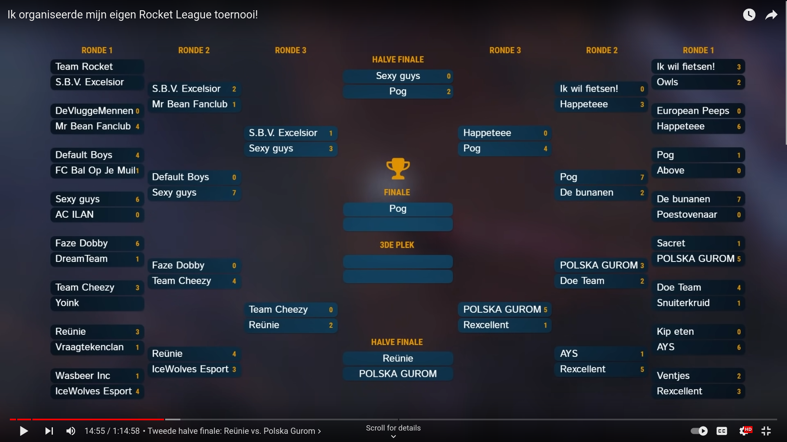

# DjuncanCup Bracket Overlay

This is a live-tournament-bracket as [OBS](https://obsproject.com/) overlay used for a Rocket League Tournament called DjuncanCup.

Dit project is gemaakt om de live status van een gamebracket in obs als overlay te laten zien.
De data wordt elke x seconden gerequest van een API die gelinked is aan het team achter het tournament.

## Tournament
The tournament consisted of 32 teams competing for a prize.

Organizer of the tournament: [Djuncan](ttps://www.youtube.com/user/BananaFlavourHD)

Game: [Rocket League](https://www.rocketleague.com/) 
## Live Demo
See the project in action on Youtube [HERE](https://youtu.be/RwOKFrCBebc?t=885)
(Timestamp: 14:45)

You can check out the animation [here](https://rikk010.github.io/DjuncanCupBracket), the data probably does not load because the server is not running.

## Program
The whole project includes a discord bot, webserver and the front-end.
The discord bot was used for submitting game-scores by moderators/referees.

This repository is just the front-end that requests the data from the webserver. It does not use websockets because of a project requirement.

## Api Enpoints Used
`/data`: Geeft de huidige status van het tournooi terug
`/getteams`: Geeft de ganem van de teams terug
